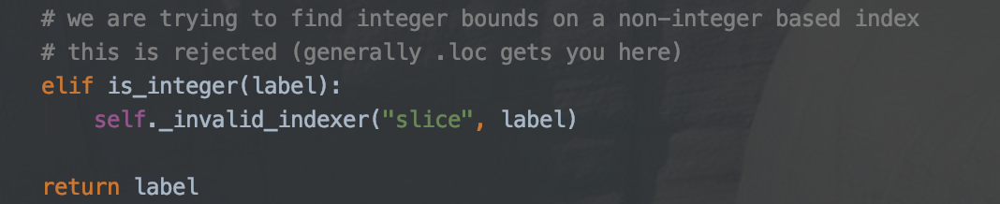

# 房屋价格预测

>本章节实现了对房屋价格预测的整个组件流程，此处只列出部分有意义内容\
为什么这里将这个”房屋价格预测“功能称为组件？是因为在实际的项目中，房屋价格预测可能是一个非常庞大的项目中的一个独立的小模块，就如书中所说，房屋价格预测可能只是针对房地产投资的流水线中的一环

## 下载数据

```python
# 解压文件
Tarfile.extractall(path="")  #解压当前压缩包中的所有文件到指定路径
Tarfile.extract(member,path="") #解压当前压缩包中指定的文件（通过member指定）到指定路径
TarFile.getmembers()  # 获取当前压缩包中包含的文件
```

## 快速查看数据

```python
import pandas as pd
pd.DataFrames.head(n=rows) #列出数据集前n行,默认为5
pd.DataFrames.tail(n=rows) #the last n rows of the dataframe
```

查看head()方法的源码得知，head()通过iloc[:n]实现，根据head()结果，我们可以知道iloc[:n]可以得到数据集中的前n行;\
既然head()是通过iloc[:n]实现，那么显而易见，tail()应该也类似，是使用iloc[-n:]

###  *题外话*: iloc到底是什么呢？
stackoverflow上的这个回答很值花上几分钟学习一下～ [How are iloc, ix and loc different?](https://stackoverflow.com/questions/31593201/how-are-iloc-ix-and-loc-different)这篇回答详细解释了这三种slicing的方法，这里大概总结下：

**ix[:n]**: ix既可以根据index实际的值获取数据，也可以根据index的position 获取数据，个人感觉比其他两种更复杂，非常“可惜”的是，从官方文档我们可以知道ix现在已经废弃了，不推荐使用。
>Warning: Starting in 0.20.0, the .ix indexer is deprecated, in favor of the more strict .iloc and .loc indexers.
ix具体服用方法可以参考下面的代码：
```python
import pandas as pd
data = pd.Series('Nan', index=[4, 5, 6, 1, 2])
print(data.ix[2:]) 
#output
# 2    Nan
# index全为integer时，ix根据index的实际获取元素
 
data = pd.Series('Nan', index=['a', 'b', 'c', 1, 2])
print(data.ix[2:])
# output
# c    Nan
# 1    Nan
# 2    Nan
# index不全为integer时，使用integer获取元素时，实际对应的是index的position，而不是index中的integer的value
```

---
**iloc[:n]**: 其中n只能为integer，且表示根据index的position，即"n"进行筛选，所以不论index为哪种类型的值，iloc都可以使用，因为它与index的类型无关 \
例如，index依次为[5,4,3,2,1]时，iloc[:2]获取到的数据为index=[5,4]前两行，而不是index=[5,4,3,2,1]

---
**loc[:n]**:其中n可以为integer也可以是其他类型，表示根据index的value，即"n"进行筛选，但是值得一提的是，如果index为non-integer类型，比如[2,1,'a','b']这种mixed index，使用loc[:2]就会抛出TypeError异常，查看下图的源码，会发现python限制了这种基于non-integer index使用integer的操作




---
